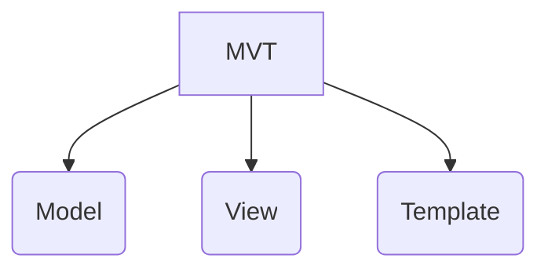

# BUSPRIX
# Introduction

In this fast moving world of science and technology, transportation is an imperative aspect, something that we just cannot do without. The four of us in our team of Bus Prix, aim to ease the hassle of travel through our very intriguing user interactive web app.

Buses are the most common, easy and cost effective modes of transport these days. Therefore, we have designed user friendly apps that facilitate the booking of buses from one destination to another, with the click of a button.

Features in our websites include a user attractive and interactive home page, easy login and signup, filter to choose the buses only pertaining to the origin and destination input by the customer, booking of tickets in just one click and display of booking status.

**Django** is a Python-based free and open-source web framework that plays a paramount role in the implementation of our web app. Along with which, we have used HTML, CSS and Javascript for the design of our webpage.

# Installation
This installation is specific to linux systems for other OS it may vary slightly.

So first we need package manager for python so use following command

```sudo apt install python3-pip -y```

Next we need **Django**
To install the package, run the apt command below.

```apt install python3-django```

Check its version using

```django-admin --version```

We also need to install crispy forms and that in the project directory
To install that package use following command

```pip install django-crispy-forms```


# Methodology

We have used **Django** for the backend development and HTML,CSS and JAVASCRIPT for frontend development in our project.

## How Django works

Django is made up of a series of components that helps it receive and respond to user requests. Here's a quick overview of how that works.

### A Request/Response System
Django can accept requests for URLs like www.example.com, and return all of the HTML needed for a web browser to render a page.

### Web Requests Enter Django Applications via URLs
The entry point to Django applications are URLs. Django developers have full control of what URLs are available in their application. Django will pass it to a view for processing.

### Requests are Processed by Views
Django Views are custom Python code that get executed when a certain URL is accessed. Views can be as simple as returning a string of text to the user. Once a view is done processing, a web response is provided back to the user.

### Web Responses are Returned
When a user accesses a URL in a browser, what is shown in the window is the web response. Most often this is a HTML web page, showing a combination of text and images. These pages are created using Django's templating system.

## MVT( Model-View-Template )
  
Django is based on  **MVT (Model-View-Template)**  architecture. MVT is a software design pattern for developing a web application.

**MVT Structure has the following three parts –**



### Model 
 Model is going to act as the interface of your data. It is responsible for maintaining data. It is the logical data structure behind the entire application and is represented by a database (generally relational databases such as MySql, Postgres). 

### View  
The View is the user interface — what you see in your browser when you render a website. It is represented by HTML/CSS/Javascript .

### Template 
 A template consists of static parts of the desired HTML output as well as some special syntax describing how dynamic content will be inserted.

## User Authentication
Django provides a User authentication system that allows you to verify user credentials and define what actions each user is allowed to perform. The framework includes built-in models for **User**, permissions/flags that designate whether a user may perform a task, forms and views for logging in users, and view tools for restricting content.

>**Note:** The authentication system in Django aims to be very generic and doesn’t provide some features commonly found in web authentication systems.

### Enabling Authentication
The necessary configuration was all done for us when we created the app using the **`django-admin startproject`** command. The database tables for users and model permissions were created when we first called **`python manage.py migrate`.**

## Users and Groups
When we created superuser with the command **`python manage.py createsuperuser`**, the superuser is already authenticated and has all permissions, so we'll need to create a test user to represent a normal site user.

The primary attributes of the default user are:
- username 
- email
- password
- first_name
- last_name

Django provides almost everything you need to create authentication pages to handle login, log out, and password management. This includes a URL mapper, views and forms, but it does not include the templates — we have to create our own!

# Work Done
Although each project member had their own implementation of the project, we used a common overall base schema.

## Base Schema
    * `Bus`
      * id
      * name
      * contact
      * type
      * noOfSeats

    * `Passenger`
      * id
      * name
      * aadharID
      * birthDate

    * `Tickets`
      * id
      * passenger(f-key) 
      * routes(f-key)
      * tripID(f-key)

    * `BusStand`
      * id
      * name
      * location
      * busID(f-key)

    * `Routes`
      * id
      * origin
      * destination
      * busID(f-key)
      * cost
      * stationTime
      * destinationTime

    * `Query`
      * id
      * name
      * email
      * phone
      * desc
      * queryStatus
      * queryDate
    
    * `TripDate`
      * id
      * date

    * `Seats`
      * noOfSeatsBooked
      * route(f-key)
      * tripDate(f-key)

According to this schema we first put some data about the bus, bus stand, and the routes using `bus_id` and `bus_stand_id.`

The main objective is that the user should be able to search for any bus and access his/her tickets only after they are logged-in.


## User-Authentication
We did not build authentication from scratch, rather, we used a built-in Django function.
  * We import authenticate, login, logout from `django-contrib-auth`
  * When a user registers, we store all the data in a User object which takes only five parameters by default. They are - username,  email, password, first_name and last_name.
  * So all the user data is just saved in our User Object and Passenger object.
  * When the user is successfully logged in, we can access their data from User Object by filtering Object's user with that user which is requesting.
  * Then we use this data for more functioning in other places.
  * We store this data in the database, that is SQLite, and we use this whenever needed.
  * When the user clicks on the logout, they’re logged out and redirected to the home page.


## Views
  * The index function renders index.html file. This is the home page of our website, which contains all the links required for Login, Logout, Signup, Search-Bus, viewing my Tickets, sending Queries and About Us.
  * For each link we have different functions in the views file and for each function we render the corresponding HTML page.
  * When the user clicks on Search-Bus, we ask the user to enter origin and destination. This data first goes to the view through the HTTP POST method. Here we check if this route is valid and then return the buses which have a stop on this route and ask the user for the number of tickets required and if there is no such bus we display an error message.
  * Again if there are buses then the user has to enter the number of tickets required to book the tickets 
  * There is a mandatory condition that the user has to enter a number less than or equal to available seats for a particular bus.
  * After entering the number of tickets, we redirect the user to a new page where we ask the user to enter the details of each passenger who is travelling and after submitting the details, we collect this information and save all tickets accordingly with passenger_id same to all that is that is booking user's passenger_id and the route also in the ticket model.
  * When a user clicks on the “Your Tickets” link, they get all their tickets which they’ve booked till date. For this purpose, the user’s passenger_id is used, which is already stored in Local Storage.
  * There is a “Query” link which is for the user to contact us via mail, site message or by contacting and the user can track any bus via bus_id after contacting us as there is a separate number for tracking of bus via bus id.


# Results


     1

     2
     
     3
     
     4
     
     5
     
     6
     
     7
     
     8
     
